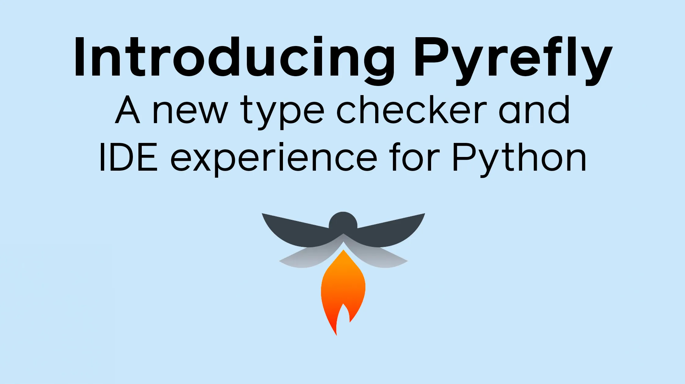

<head>
    <link rel="canonical" href="https://engineering.fb.com/2025/05/15/developer-tools/introducing-pyrefly-a-new-type-checker-and-ide-experience-for-python/" />
</head>

Today we are announcing an alpha version of Pyrefly, an open source Python typechecker and IDE extension crafted in Rust. Pyrefly is a static type checker that analyzes Python code to ensure type consistency and help you catch errors throughout your codebase before your code runs. It also supports IDE integration and CLI usage to give you flexibility in how you incorporate it into your workflow.

<!-- truncate -->

The open source community is the backbone of the Python language. We are eager to collaborate on Pyrefly with the community and improve Python’s type system and the many libraries that we all rely on.

## Get started

Ready to dive in? The [official Pyrefly website](https://pyrefly.org/) has all the details, but to quickly get started:

- [Install](https://pyrefly.org/en/docs/installation/) Pyrefly on the command-line: pip install pyrefly.
- [Migrate your existing type checker configuration to Pyrefly](https://pyrefly.org/en/docs/migrating-to-pyrefly/).
- Enhance Your IDE: Download the [Pyrefly extension for VSCode](https://marketplace.visualstudio.com/items?itemName=meta.pyrefly) and enjoy a lightning fast IDE experience from starter projects to monorepos.
- Leave feedback for us on [GitHub](https://github.com/facebook/pyrefly/issues).

## Why we built Pyrefly

Back in 2017, we embarked on a mission to create a type checker that could handle [Instagram’s massive codebas](https://instagram-engineering.com/web-service-efficiency-at-instagram-with-python-4976d078e366) of typed Python. This mission led to the birth of the [Pyre](https://github.com/facebook/pyre-check) type checker, inspired by the robust designs of [Hack](https://hacklang.org/) and [Flow](https://flow.org/), and written in OCaml to deliver scalable performance.

Over the years, Pyre served us well, but as the type system evolved and the need for typechecking to drive responsive IDE emerged, it was clear that we needed to take a new approach. We explored alternate solutions and leveraged community tools like [Pyright](https://github.com/Microsoft/pyright) for code navigation. But the need for an extensible type checker that can bring code navigation, checking at scale, and exporting types to other services drove us to start over, creating Pyrefly.

## The principles behind Pyrefly

Today, we’re excited to unveil Pyrefly, a project [we’ve been developing openly on GitHub](https://github.com/facebook/pyrefly). We invite you to explore our work and try it out on your own project. While a project like Pyrefly is the sum of thousands of technical choices, a few notable principles we’ve followed are:

### Performance

We want to shift checks that used to happen later on CI to happening on every single keystroke. That requires checking code at speed (on large codebases we can check 1.8 million lines of code per second!) and careful thought to incrementality and updates. Pyrefly is implemented in Rust and designed for high performance on codebases of all sizes.

### IDE first

We want the IDE and command line to share a consistent view of the world, which means crafting abstractions that capture the differences without incurring unnecessary costs. Designing these abstractions from the beginning is much easier than retrofitting them, which we tried with Pyre.

### Inference

Some [Python programs are typed](https://engineering.fb.com/2024/12/09/developer-tools/typed-python-2024-survey-meta/), but many aren’t. We want users to benefit from types even if they haven’t annotated their code – so automatically infer types for returns and local variables and display them in the IDE. What’s more, in the IDE you can even double click to insert these inferred types if you think that would make the program better.

### Open source

Python is open source, and hugely popular. The [Python typing specification](https://typing.python.org/en/latest/spec/) is open source, which made Pyrefly vastly easier to develop. Many of the libraries Meta contributes to are open source,( e.g., [PyTorch](https://pytorch.org/)).

Pyrefly is also open source, [available on GitHub](https://github.com/facebook/pyrefly/) under the [MIT license](https://github.com/facebook/pyrefly/blob/main/LICENSE), and we encourage [pull requests](https://github.com/facebook/pyrefly/pulls) and [issue reports](https://github.com/facebook/pyrefly/issues). We also have a [Discord channel](https://discord.gg/Cf7mFQtW7W) for more free flowing discussions. We would love to build a community around Pyrefly.

## The future of Pyrefly

We will work with the Python community to drive the language forward and improve the developer experience. Since the beginning of Pyre, we open sourced our code and contributed a number of PEPs alongside the community of type checker maintainers. We feel we can do more with Pyrefly to help Python developers leverage the benefits of types for developers, library authors, and folks just learning the language.

Meta has leveraged types in dynamic languages from the beginning and knows the significant benefits it brings to developer productivity and security. We plan to share more of our learnings and tooling with [blogs](https://engineering.fb.com/2024/12/09/developer-tools/typed-python-2024-survey-meta/), better types in the ecosystem and language enhancements.

Today we’re releasing Pyrefly as an alpha. At the same time, we’re busy burning down the long-tail of bugs and features aiming to remove the alpha label this Summer. Your feedback is invaluable to get there, so please give it a try and [report your bugs](https://github.com/facebook/pyrefly/issues) or things you think can be improved. Even if Pyrefly isn’t right for your project, we would love to hear how you use types and what you would like to see improved in your editor.

Join us on the journey as we help illuminate your bugs with Pyrefly. Happy coding! 🐍✨

## Hear more about Pyrefly

Check out the [episode of the Meta Tech Podcast](https://engineering.fb.com/2025/05/15/developer-tools/open-sourcing-pyrefly-a-faster-python-type-checker-written-in-rust) where several team members share their experience developing Pyrefly and technical details for how it works. We also just [talked at PyCon US](https://us.pycon.org/2025/schedule/presentation/118/) about high-performance Python through faster type checking and free threaded execution.

To learn more about Meta Open Source, visit our[open source site](https://opensource.fb.com/), subscribe to our [YouTube channel](https://www.youtube.com/channel/UCCQY962PmHabTjaHv2wJzfQ), or follow us on [Facebook](https://www.facebook.com/MetaOpenSource), [Threads](https://www.threads.net/@metaopensource), [X](https://x.com/MetaOpenSource), and [LinkedIn](https://www.linkedin.com/showcase/meta-open-source?fbclid=IwZXh0bgNhZW0CMTEAAR2fEOJNb7zOi8rJeRvQry5sRxARpdL3OpS4sYLdC1_npkEy60gBS1ynXwQ_aem_mJUK6jEUApFTW75Emhtpqw).

### Acknowledgements

_Pyrefly was created By Meta’s Python Language Tooling Team: Jia Chen, Rebecca Chen, Sam Goldman, David Luo, Kyle Into, Zeina Migeed, Neil Mitchell, Maggie Moss, Conner Nilsen, Aaron Pollack, Teddy Sudol, Steven Troxler, Lucian Wischik, Danny Yang, and Sam Zhou._
