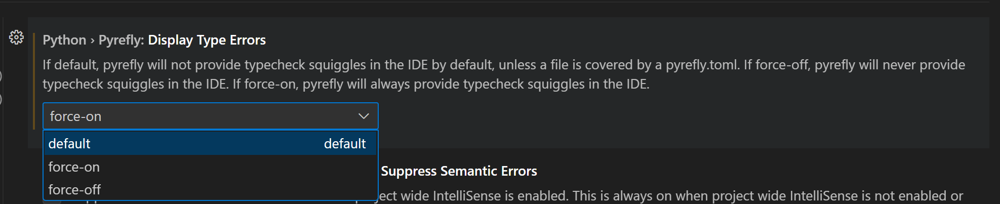

The challenges of managing ever-growing codebases are hardly new. As far back as 1995, Niklaus Wirth, (creator of programming language Pascal) already emphasized the importance of keeping software lean in his essay [A Plea for Lean Software](https://l.facebook.com/l.php?u=https%3A%2F%2Fpeople.inf.ethz.ch%2Fwirth%2FArticles%2FLeanSoftware.pdf&h=AT2RMg0sKqoJzLiFe4OIBZRxVLklBs9SeIlBrZnHnaEVP2VVCAG8Z9vuiFo4kP_MoegKDrRBKhxV_0cuWBijok2KhvKG9nLhUm5USFJC2Nzlq8yhSOvWirfU_BnPIve4Ofo7c-emKgWgbBEI3w). Fast forward to today: many programmers still face the reality that, despite their best coding intentions, as projects grow in size and complexity, so do their codebases. Even when a project scales to millions of lines of code, developers still expect their IDE to be fast, accurate, and efficient. And with increasingly large and interconnected (dare I say, spaghetti?) code, you probably rely on your IDE even more to help you navigate the chaos (ahem I mean complexity).

<!-- truncate -->

But what you may not have thought about before is that scaling project size presents a real challenge for your IDE: how do you keep code navigation tools responsive and reliable when the codebase keeps expanding? In this blog, we’ll explore this challenge and introduce you to Pyrefly \- a scalable language server and typechecker designed to keep your Python development experience smooth and snappy at scale.

## **Background \- What is a Language Server and Why Does It Matter?**

The Language Server Protocol (LSP) is a standardized way for code editors to communicate with language-specific servers that provide features like autocomplete, go-to-definition, and symbol renaming. Instead of each editor implementing these features separately, LSP allows a single language server to support multiple editors. Pyrefly’s language server capabilities are based on the [Language Server Protocol Specification](https://microsoft.github.io/language-server-protocol/specifications/lsp/3.17/specification/) and are designed to still be blazing fast even on code bases with over 20 million lines of code.

A key capability of many language servers, including Pyrefly, is typechecking, which enhances IDE features by providing type diagnostics. Pyrefly’s language server not only reports type errors like basic type checkers, such as [Mypy](https://github.com/python/mypy), but also replaces core IDE functionalities including “find definition,” hover (displaying types and docstrings), and completions. By consolidating these features, Pyrefly ensures that the types it checks and the types displayed in your IDE will always match.

## **Instagram \- A Case Study on the Pain of Slow Code Navigation**

Meta operates an incredibly large Python codebase \- a massive monorepo containing **almost 1.5 million Python files** maintained by thousands of developers. Instagram is one of those projects, with **over** **20 million lines** of Python code. At this scale, even simple navigation tasks like jumping to a function definition, searching for references, or loading syntax highlights could take almost a minute in the worst cases. That may not sound like a lot on its own, but experiencing it every few minutes quickly becomes frustrating and has a tangible impact on developer productivity, especially when multiplied across a large company like Meta.

Pyrefly emerged in part to address this exact challenge (you can read more about our origin story in our [intro blog](https://pyrefly.org/blog/introducing-pyrefly/)). In real world use cases, developers who switched from Pyright (the default LSP for VSCode) to Pyrefly spent **98%** less time waiting on hover results and go-to definition was **\~10x** faster. On the slowest files (p99), these IDE responses grew from an order of minutes to seconds (**30x** improvement). If those numbers are hard to visualise, the TL;DR is that this upgrade took instagram developers from questioning “is my editor frozen?” to not giving their IDE a second thought.

  <video
    src="/videos/pyrefly-ide-comparison.mov"
    style={{maxWidth: '50%'}}
    muted
    loop
    autoPlay
    playsInline
    preload="metadata"
  ></video>
  <video
    src="/videos/pyright-ide-comparison.mov"
    style={{maxWidth: '50%'}}
    muted
    loop
    autoPlay
    playsInline
    preload="metadata"
  ></video>

_Pyrefly (left) vs Pyright (right) autocomplete speed comparison_

These early results are certainly promising indications of a smoother developer experience for Meta engineers, and we're excited to share more insights as developers continue using Pyrefly. But Pyrefly isn’t just for Meta developers, it’s open source and ready for everyone to explore\! If you’re curious about Pyrefly’s language server features and want to see how to get it up and running in your IDE, keep reading\!

## **Pyrefly LSP at a Glance**

While Pyrefly is still in Alpha as of the time of posting, it already supports most of the essential IDE capabilities that Python developers rely on daily, such as:

- **Autocomplete:** predicts what you’re likely to type next, reducing the need to remember exact names of variables, functions, and others, even importing them automatically for you
- **Go to Definition**: allows you to jump directly to the source of a function, class, or variable with a single click.
- **Hover:** when you hover over a symbol, Pyrefly displays useful information such as type annotations, documentation, and inferred types.
- **Rename symbols**: right click to rename variables, functions, or classes across the entire codebase.
- **Typechecking**: Pyrefly will also show type errors and infer types, which you can toggle on or off in your Pyrefly settings (more info in the next section)
- **And many more**\! explore the full list and details in the [Pyrefly IDE docs](https://pyrefly.org/en/docs/IDE/).

The Pyrefly team and our open-source community are continuously working on improvements and new features so stay tuned for updates\! We also want to hear from you \- what features do you need to make your IDE experience better? [Open a GitHub issue](https://github.com/facebook/pyrefly/issues) or [join our discord](https://discord.gg/Cf7mFQtW7W) to share your thoughts.

## **How to add Pyrefly to your IDE**

Pyrefly can be used in a range of IDEs, including standard GUI editors like **VSCode** or **Pycharm**, terminal editors like **Neovim** or **Emacs**, and AI editors like **Cursor** or **Windsurf**. You can check out the full list of supported IDEs in the [Pyrefly IDE docs](https://pyrefly.org/en/docs/IDE/).

For GUI editors, setup is pretty straightforward and generally follows the same steps:

1. Search for “pyrefly” in the appropriate extension marketplace for your IDE and install it
2. Open any Python file and the extension will activate automatically
3. **Note**: if using an editor other than VSCode you may need to uninstall the default Python LSP in your editor. You can do this by opening your extension settings and setting `"Language Server: None"`
4. **Optional**: we recommend all developers use a typechecker as part of their regular software development process, however we know that type errors in your IDE can be noisy, so the type errors feature is not turned on by default if you don't have a `pyrefly.toml` (from `pyrefly init`). If you DO want type errors to show up in your editor everywhere (as red squiggles), you should update your extension settings to include `"python.pyrefly.displayTypeErrors": "force-on"`

For terminal editors the setup process can vary depending on which editor you use so check out the [installation documentation](https://pyrefly.org/en/docs/IDE/#other-editors) for specific instructions.

## **Conclusion**

As Python projects continue to grow in size and complexity, having a fast, reliable, and scalable language server is essential for maintaining developer productivity (and our sanity to be honest). So if you’re working on a large codebase and want an LSP designed with scalability in mind we invite you to give Pyrefly a try\!

While the project is still in Alpha we’re especially eager to hear from more users like you about how the IDE extension performs on real world codebases. If you have any feedback, bug reports or feature requests please feel free to [open a GitHub issue](https://github.com/facebook/pyrefly/issues), and if you have any questions or need support please come chat with us on [Discord](https://discord.com/invite/Cf7mFQtW7W)!

Happy coding, fellow pyreflies\! 🔥🪰
